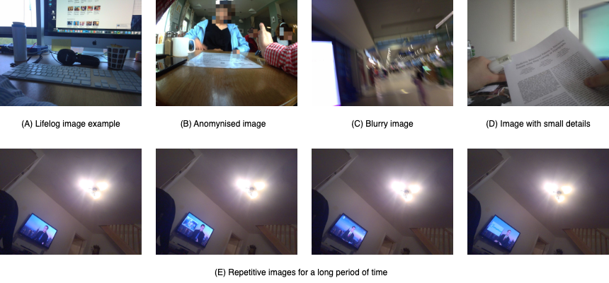
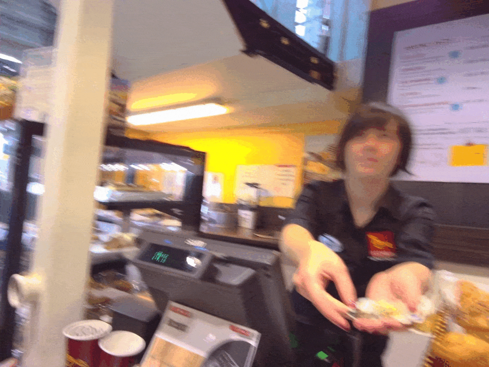
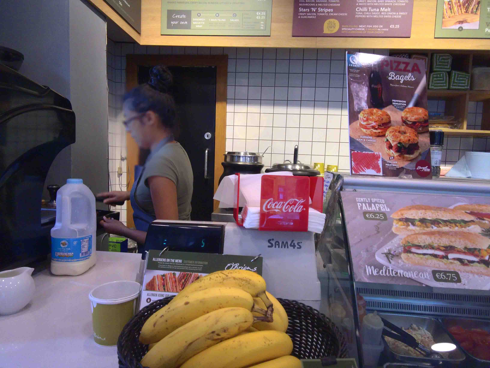
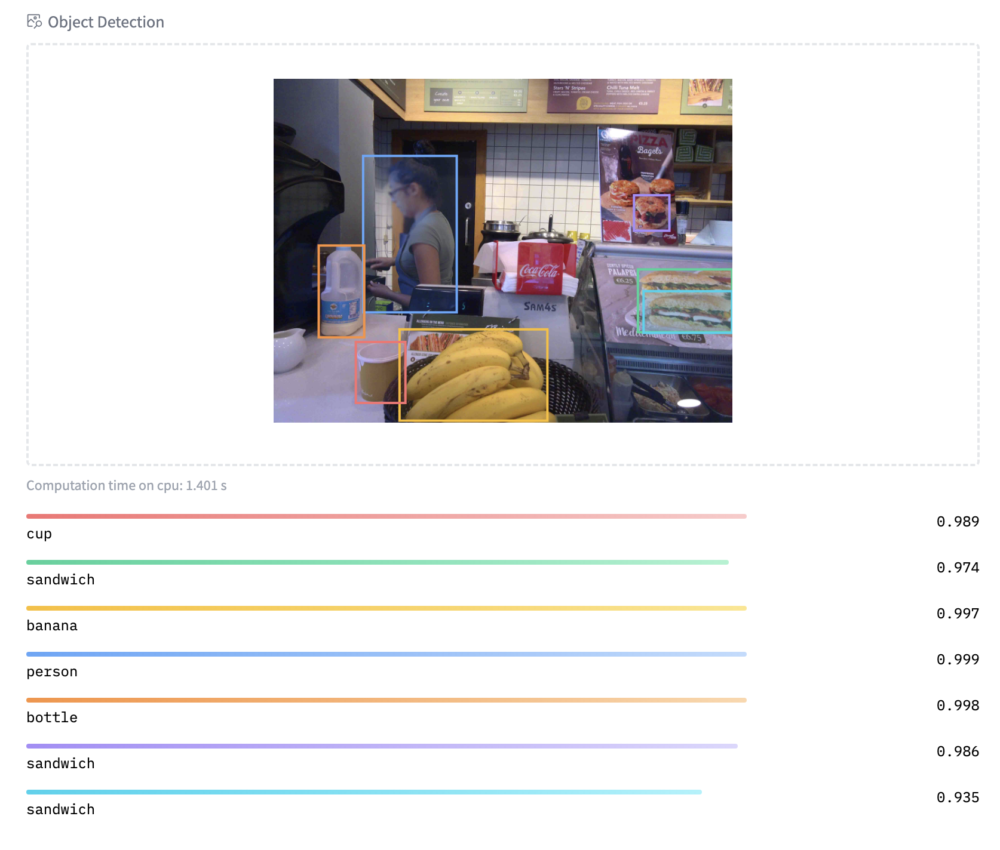
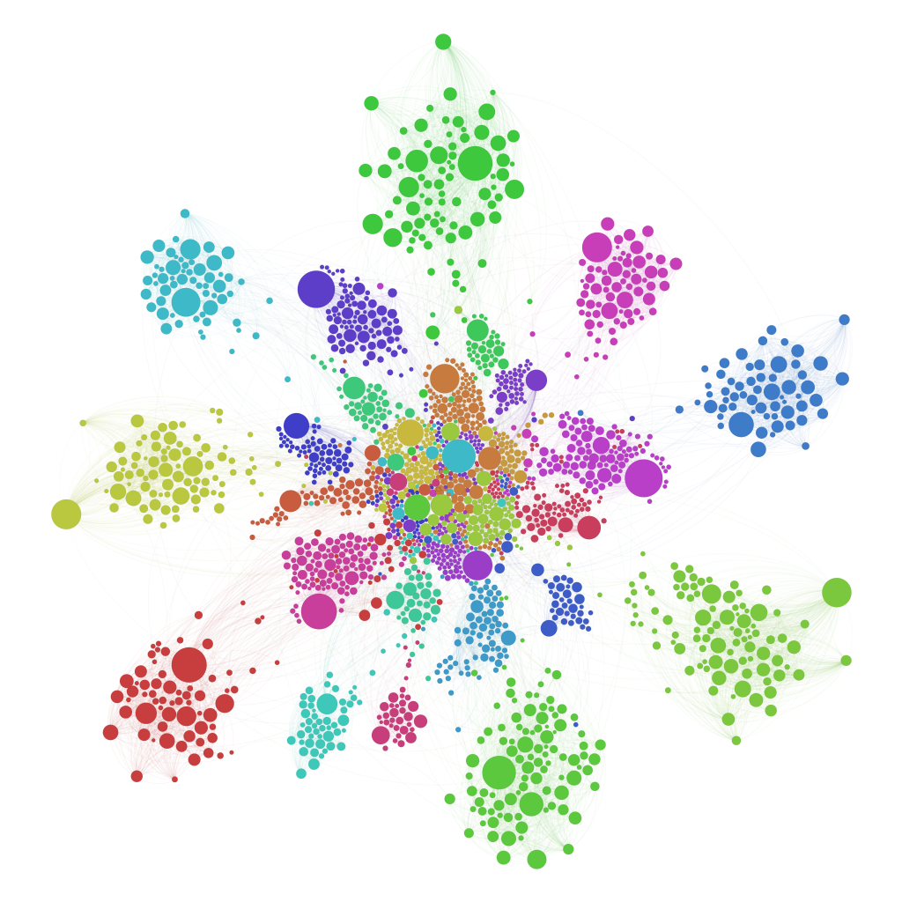

# Lifelogging and Image-Text Modelling
Ly-Duyen Tran (Allie)  
<ly.duyentran@dcu.ie>


## Outline
1. Introduction to Lifelogging 
2. Lifelog Retrieval
3. Concept-based Retrieval
4. CLIP model
5. Miscellaneous 


## Lifelogging

- Lifelogging is the process of tracking personal data generated by our own daily activities.
- It is a way to record and store our memories, experiences, and emotions.




## Applications of Lifelogging
- Personal memory enhancement
- Health monitoring
- Personal data analysis


## Lifelog Retrieval
- Lifelog retrieval is the process of searching and retrieving lifelog data.
- It is a challenging task due to the large amount of data and the need for efficient retrieval methods.

> I needed to buy a blood pressure monitor. So I was looking in a pharmacy that sold Omron and Braun devices.




## Test Dataset
- For demonstration purposes, I will use the test dataset from the Lifelog Search Challenge 2022.


## Example of the dataset:
- Image: ![[lifelog_example.png]]
- Metadata: csv file

```plaintext, wrap
ImageID,new_lat,new_lng,semantic_name,city,country,timezone
20190105_164008_000.jpg,53.386,-6.261,DCU School of Computing,"Dublin, Ireland, Leinster",Ireland,Europe/Dublin
20190105_164040_000.jpg,53.386,-6.261,DCU School of Computing,"Dublin, Ireland, Leinster",Ireland,Europe/Dublin
20190105_164112_000.jpg,53.386,-6.261,DCU School of Computing,"Dublin, Ireland, Leinster",Ireland,Europe/Dublin
20190105_164144_000.jpg,53.386,-6.261,DCU School of Computing,"Dublin, Ireland, Leinster",Ireland,Europe/Dublin
```

## Example query

> I needed to buy a blood pressure monitor. So I was looking in a pharmacy that sold Omron and Braun devices.

[MyEachtra - an example lifelog retrieval system](https://mysceal.computing.dcu.ie)


## Demos

- I will use standard Computer Vision and NLP models to demonstrate the retrieval of lifelog data.
- All the models can be found on [Hugging Face](https://huggingface.co/models) and [OpenAI](https://openai.com/clip/).
- Practice code can be found on [my GitHub](https://github.com/allie-tran/GuestLecture/blob/main/coco_demo.ipynb) and can be open with Google Colab.


### What is HuggingFace?
- Hugging Face is an AI research organization that provides state-of-the-art models for NLP and Computer Vision.
- The models are available for free and can be used for various tasks such as classification, translation, summarization, etc.
- The models can be used in Python through the __transformers__ library.


### What is Google Colab?
- Google Colab is a free cloud-based Jupyter notebook environment provided by Google.
- It allows users to run Python code in the cloud without the need to install anything on their local machines.


## Metadata
- Some of the metadata can be used for retrieval purposes:
    - Location: latitude, longitude, city, country
    - Time: timestamp, timezone
- We can use filters.

```python
# Filter based on location
# assuming the metadata is stored in a pandas dataframe
location = "Dublin"
filtered_images = df[df["city"].str.contains(location, na=False, case=False)]
```


## Concept-based approach
Computer Vision models can be used to extract concepts from images. 


### Analogy
#### Imagine you were in a library...
And you want want to find a book about __Famous Scientists__.
You would go to the _Science_ section and have a look at the books there.It means the books are organized based on genres or subjects.

So, in the same way, we can organize images based on concepts.


### What are concepts?

- Concepts are the objects, actions, or scenes that are present in the images.



What can be the concepts in this image?


### Object Detection example
Model : [DETR](https://huggingface.co/facebook/detr-resnet-50)



```python
ImageId = "20160808_111247_000.jpeg"
concepts = ["cup", "sandwich", "banana", "person", "bottle"]
```


### Discussion
- What other computer vision models can be used for concept extraction?


### Concept-based Retrieval
- The user can search for images based on concepts and text.
- Example: "Find images of people walking in Dublin"
- Keywords: "people", "walking", "Dublin"

```python
results = df[df["tags"].str.contains("people") & df["tags"].str.contains("walking") & df["city"] == "Dublin"]
```


### Using captions
- Captioning models can be used to extract concepts from images.
```plaintext, wrap
ImageID,Description
20160808_111247_000.jpeg,"A till operator is serving a customer at the cafe"
```
We can use a more advanced text-retrieval model to search for images based on the captions, such as TF-IDF


### TF-IDF
- _Term Frequency-Inverse Document Frequency (TF-IDF)_ is a statistical measure used to evaluate the importance of a word in a document.
- _TF_: the frequency of a word in a document
- _IDF_: the inverse of the frequency of the word in the entire corpus - the higher the frequency, the lower the IDF (words like __the__, __and__, __is__ have low IDF)


#### Example

```python
# Using TF-IDF
from sklearn.feature_extraction.text import TfidfVectorizer
vectorizer = TfidfVectorizer()
# Fit and transform the captions
X = vectorizer.fit_transform(df["Caption"])

# Search for images based on the captions
query = "I am ordering a coffee at the cafe"
query_vector = vectorizer.transform([query]) # transform the query
results = cosine_similarity(X, query_vector) # calculate the similarity
results = results.argsort()[-10:][::-1] # get the top 10 results

```

## Problems
* You need to know the concepts in advance.
* The concepts are not always available in the metadata.
* Lots of models are needed for different concepts.
* The captions are not necessarily on the same level of abstraction as the user's query.


## Embedding-based Retrieval

Ref: [Kaggle](https://www.kaggle.com/code/minc33/visualizing-high-dimensional-clusters)


### Analogy
#### Back to the library...
You want to find a book about __Famous Scientists__.  

The library has a system that can find books based on their content. She doesn't care about the genre or subject, but she knows what books are similar to each other. 

She can guide you to the shelf where _similar_ books are located.


### What are embeddings?
- Simply put, embeddings are numerical representations of data.
- They are used to represent:
    - Images
    - Text
    - Audio
    - etc.
- There is a distance metric that can be used to measure the similarity between embeddings.
    - Euclidean distance
    - Cosine similarity


### CLIP model
- CLIP (Contrastive Language-Image Pretraining) is a model developed by OpenAI.
- It can be used to retrieve images based on text and vice versa.


Ref: [OpenAI](https://openai.com/clip/)


## How does it work?

- Inputs: pairs of image and text
- Outputs: similarity matrix
- Objective: maximize the similarity between the correct pairs and minimize the similarity between the incorrect pairs. (Contrastive Loss)


## How to use it?
- Lifelog images can be encoded: _encoded images_
- Search query can be encoded: __encoded query__
- The similarity between the _encoded images_ and the __encoded query__ can be calculated using the similarity matrix.

```python
similarity = (100.0 * image_features @ text_features.T).softmax(dim=-1)
```

where _@_ is the matrix multiplication and _softmax_ is the normalization function.


## Example


Description A: "I am ordering a coffee at the cafe"
Description B: "I am hiking in the mountains"

```python
## Setting up the model
import torch
import clip
from PIL import Image

device = "cuda" if torch.cuda.is_available() else "cpu"
model, preprocess = clip.load("ViT-B/32", device=device)
```


```python
# Open the image
image = preprocess(Image.open("2019-08-01_09-00-00_0.jpg")).unsqueeze(0).to(device)
# Tokenize the descriptions
texts = clip.tokenize(["I am ordering a coffee at the cafe", "I am hiking in the mountains"]).to(device)

# Encode the image and texts
with torch.no_grad():
    image_features = model.encode_image(image)
    text_features = model.encode_text(text)

    # Calculate similarity
    similarity = (100.0 * image_features @ text_features.T).softmax(dim=-1)
    print(similarity)
```


## Retrieval
 The similarity scores can be used to retrieve images based on text and vice versa.

```python
# Assuming the images are already encoded
image_features
# Retrieve images based on text
text = "I am ordering a coffee at the cafe"
similarities = [similarity_score(image, text) for image in image_features]
sorted_images = sorted(similarities, key=lambda x: x[1], reverse=True)
result = [image[0] for image in sorted_images[:10]]
```

## Query-by-Example
If the user has an example image, the similarity between the example image and the rest of the images can be calculated.

```python
# Assuming the images are already encoded
image_features

# Open the example image
example_image = preprocess(Image.open("example.jpg")).unsqueeze(0).to(device)
# Encode the example image
with torch.no_grad():
    example_image_features = model.encode_image(example_image)

# Calculate similarity
similarities = [similarity_score(image, example_image_features) for image in image_features]
sorted_images = sorted(similarities, key=lambda x: x[1], reverse=True)
result = [image[0] for image in sorted_images[:10]]
```


# Discussion
- What are the advantages and disadvantages of the CLIP model?
- What other scenarios can the CLIP model be used for?


# Codes
- Due to the privacy of the dataset, I cannot provide the full code here.
- However, the code for retrieving images based on text using the CLIP model can be found on [my GitHub](https://github.com/allie-tran/GuestLecture/blob/main/coco_demo.ipynb)


# Conclusion
- Lifelogging is a useful way to record and store personal data.
- Retrieval of lifelog data can be done using concept-based and embedding-based methods.
- CLIP model can be used for image-text retrieval.


# Thank you!
